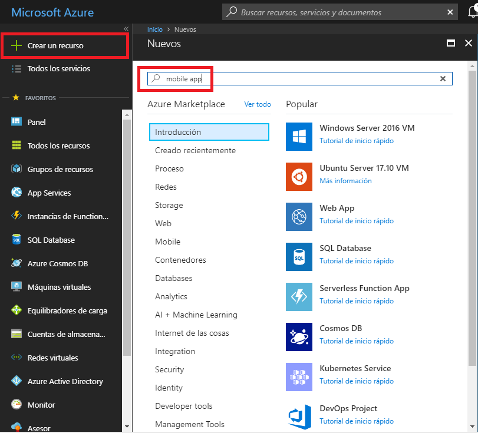
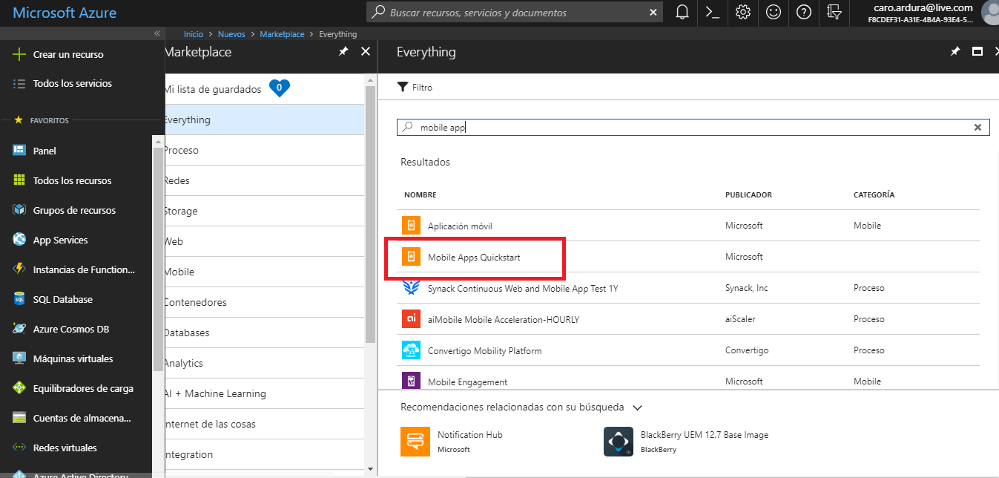
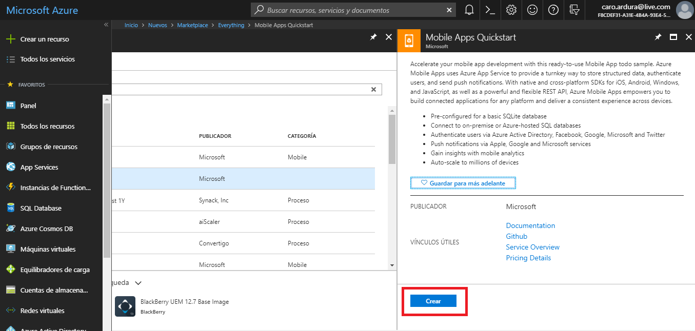
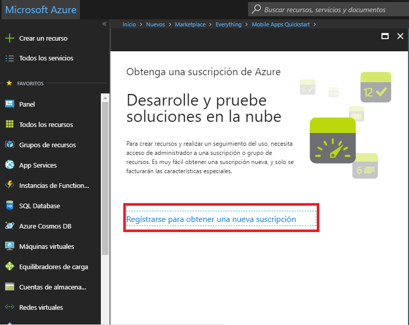
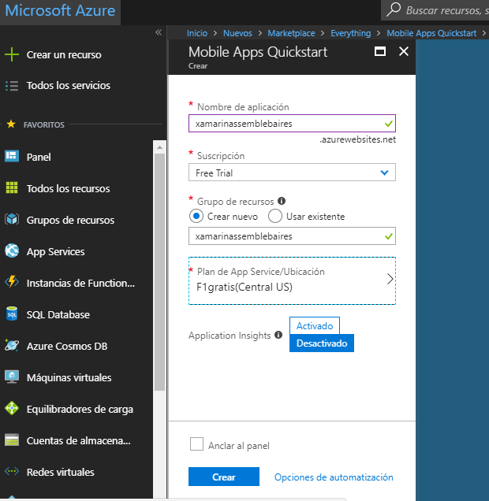
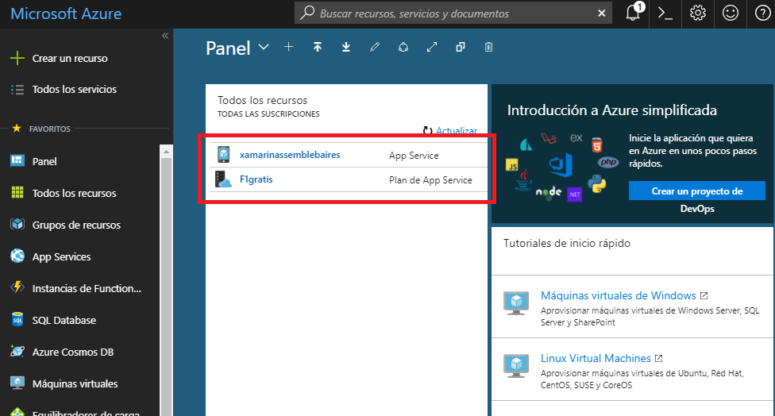
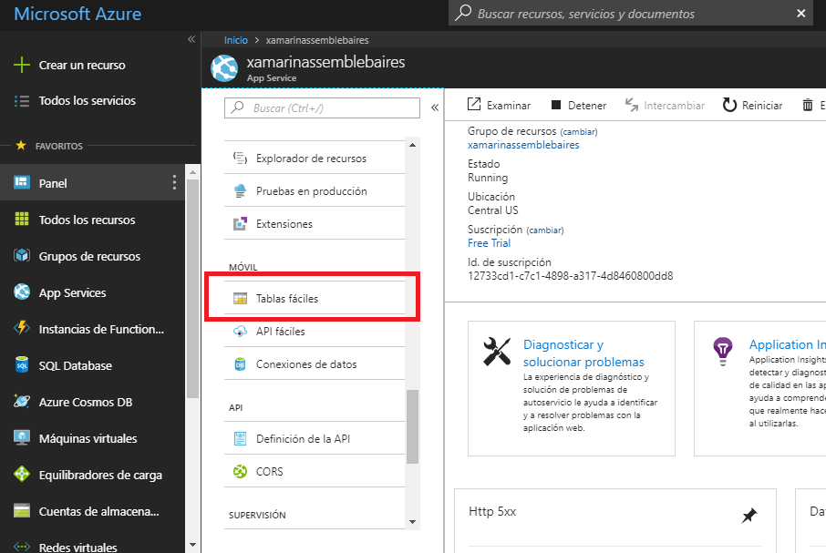
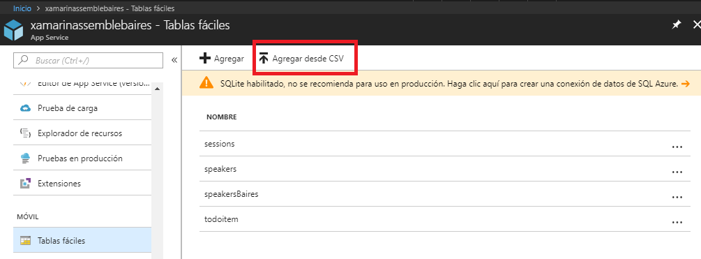
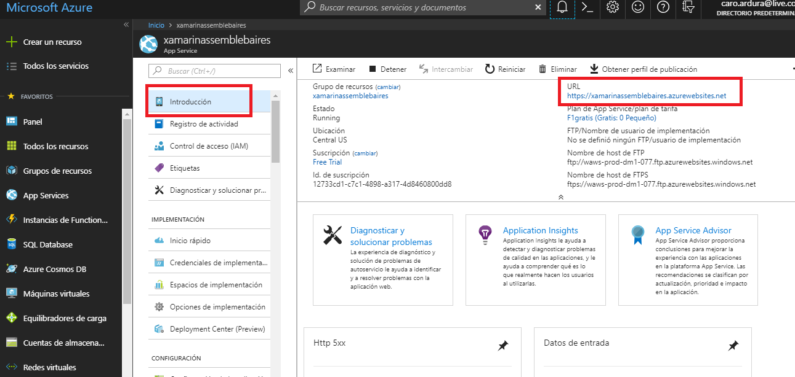

# Azure Tablas Faciles

Durante el modulo anterior escribimos una aplicacion Xamarin.Forms que tomaba informacion expuesta en un servicio RESTful. En este modulo lo que vamos a estar haciendo es configurar Azure para poder usar Mobile Apps 

## Creacion de Azure Mobile Apps usando Tablas Faciles

Entrar a la siguiente url: http://portal.azure.com 

1. Una vez dentro del portal hacer click en **Crear nuevo recurso**, escribir en el buscador **mobile apps** para que salgan los resultados como en la imagen de abajo. 



2. Luego, seleccionar **Mobile apps Quickstart**.



3. Finalmente, oprimir **Crear** para que Azure cree el nuevo recurso.



En el caso de que el usuario que estemos utilizando no tenga una suscripcion a Azure, nos va a pedir que obtengamos una.



4. Se va a abrir una ventana con cuatro campos para configurar:

    **Nombre de la aplicacion:**
    Es un nombre unico que va a ser necesario para configurar el end point. 

    **Suscripcion:**
    Seleccionamos una suscripcion de la lista.

    **Grupo de recursos:**
    Seleccionamos **Crear uno nuevo** y escribimos el mismo nombre que la aplicacion.

    **Plan de App Service/Ubicacion:**
    Hacemos click en este campo y seleccionamos **Crear nuevo**, le damos un nombre unico y seleccionamos el plan F1 Free.

Por ultimo clickear en **Anclar al panel** y luego en **Crear**. Va a tardar entre unos 3 y 5 minutos en crear el nuevo recurso. 



5. Si volvemos al Dashboard vamos a poder ver tanto el nuevo recurso como nuestra suscripcion a Azure.



6. Seleccionar nuestro recurso y buscar en el menu lateral izquierdo **Tablas faciles**



7. Haciendo click en **Agregar desde CSV** vamos a poder agregar una nueva tabla con un conjunto de datos. Asegurate de haber bajado de este repositorio los archivos speaker.csv y sessions.csv que estan en la carpeta Mock-Data



## Testeando el endpoint

Ahora que ya hemos subido nuestros datos exitosamente a nuestro backend de Azure, podemos probar que este funcionando correctamente. Solo tenemos que copiar la url del Mobile Appsd Service que aparece en **Introduccion**, dicha opcion se encuentra en el menu lateral izquierdo.



Open a Web Browser, and hit the link in the following format:

**Speaker**
```
https://<yourappservicename>.azurewebsites.net/tables/Speaker?ZUMO-API-VERSION=2.0.0 
```
**Session**
```
https://<yourappservicename>.azurewebsites.net/tables/Session?ZUMO-API-VERSION=2.0.0 
```
Both should give you the the data in `json` format.

Now, let's edit the code to access this data into our `MyEvents` app.

## Connecting App to Azure Mobile Apps backend

To connect to the Azure Mobile Apps backend & to take advantage of offline data sync support, you need two Nuget Packages `Microsoft.Azure.Mobile.Client`  and `Microsoft.Azure.Mobile.Client.SQLiteStore` added to all your projects. To save time, this has been already added. You can verify them by right clicking your solution and hit **Manage Nuget Packages for solution...**


Now, let's write some code.

Open the **MyEvents/Constants.cs** file and update the `ApplicationURL` to your Mobile App Service URL in the specified format. Please note: You don't need to append the table names. This is taken care automatically by the Azure Client SDKs.

```csharp
public static string ApplicationURL = @"https://<yourappservicename>.azurewebsites.net";
```

### Connect to Cloud

The code to connect to cloud is neatly abstracted away in the `Cloud/AzureDataManager.cs` class. Azure Client SDKs have a great support for offline data sync. Offline data sync is a client and server SDK feature of Azure Mobile Apps that makes it easy for developers to create apps that are functional without a network connection. When your app is in offline mode, users can still create and modify data, which will be saved to a local store. When the app is back online, it can synchronize local changes with your Azure Mobile App backend. The feature also includes support for detecting conflicts when the same record is changed on both the client and the backend. Conflicts can then be handled either on the server or the client. 
To take advantage of this feature, this demo uses `SyncTable` and initializes a local store. 

Here's the Initialize code for your reference

```csharp
private void Initialize()
{
    this.client = new MobileServiceClient(
        Constants.ApplicationURL);

    var store = new MobileServiceSQLiteStore("localstore.db");
    store.DefineTable<Session>();
    store.DefineTable<Speaker>();

    //Initializes the SyncContext using the default IMobileServiceSyncHandler.
    this.client.SyncContext.InitializeAsync(store);
}
```

To get data for `Sessions` and `Speakers`, the `AzureDataManager` has two methods `GetSessionsAsync()` and `GetSpeakersAsync()` which can be accessed by `IDataManager` implementation.

### Get Sessions

Open **MyEvents\ViewModels\SessionsViewModel.cs**, in the `GetSessions()` method, replace the code 
```csharp
using (var client = new HttpClient())
{
    //grab json from server
    var json = await client.GetStringAsync("https://xamarinassemblebaires.azurewebsites.net/tables/sessions?ZUMO-API-VERSION=2.0.0");

    //Deserialize json
    var items = JsonConvert.DeserializeObject<List<Session>>(json);

    //Load sessions into list
    Sessions.Clear();

    foreach (var item in items)
    {
        Sessions.Add(item);
    }
}
```
with the code to connect to cloud
```csharp
var items = await AzureDataManager.DefaultManager.GetSessionsAsync();

//Load sessions into list
Sessions.Clear();

foreach (var item in items)
{
    Sessions.Add(item);
}
```

### Get Speakers

Open **MyEvents\ViewModels\SpeakersViewModel.cs**, in the `GetSpeakers()` method, replace the code 
```csharp
using (var client = new HttpClient())
{
    //grab json from server
    var json = await client.GetStringAsync("https://xamarinassemblebaires.azurewebsites.net/tables/speakers?ZUMO-API-VERSION=2.0.0");

    var items = JsonConvert.DeserializeObject<List<Speaker>>(json);

    Speakers.Clear();
    foreach (var item in items)
    {
        Speakers.Add(item);
    }
}
```
with the code to connect to cloud
```csharp
var items = await AzureDataManager.DefaultManager.GetSpeakersAsync();

Speakers.Clear();

foreach (var item in items)
{
    Speakers.Add(item);
}
```
That's it. Now run the app and see the data being pulled in from your Azure Easy Tables backend.

## Run the App!
Run the app on all available platforms. Head to Speakers tab and click on any speaker, edit the title and save. See if the data changes. Also, hit the url again to see if the data has been updated back in the cloud.


## Wrapping Up!
We did great again! We looked at creating a no code backend with EasyTables and consumed the data in our app. Sessions and Speakers data were pulled from the cloud and updated the Speaker titles from the app. In the next module, we will look at creating a scalable backend using .NET APIs and authenticating users.
